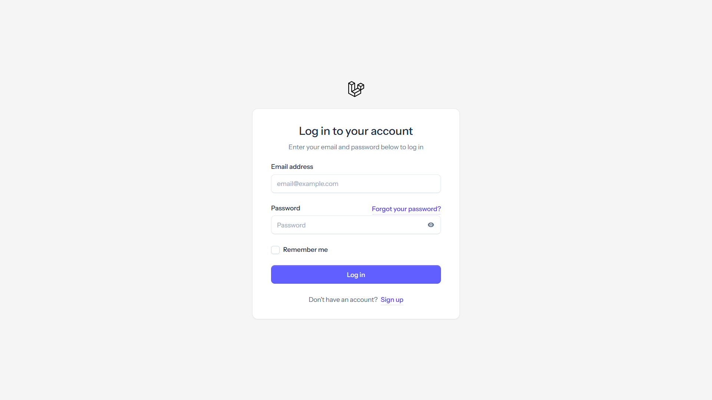

<p align="center">
    
    <div></div>

  
  
  
  
  
</p>

# Laravel Livewire Starter Kit

Selamat datang di Laravel Livewire Starter Kit! Proyek ini berfungsi sebagai titik awal untuk membangun aplikasi web menggunakan framework Laravel, yang secara spesifik terintegrasi dengan Livewire, Volt, dan Flux UI.

## 📜 Tentang

Starter kit ini menyediakan struktur proyek Laravel standar dengan fitur-fitur tambahan yang sudah dikonfigurasi sebelumnya untuk mempercepat proses pengembangan:

* **Laravel Framework:** Menggunakan versi terbaru dari framework PHP Laravel.
* **Livewire:** Framework full-stack untuk Laravel yang memungkinkan Anda membangun antarmuka dinamis menggunakan PHP saja.
* **Volt:** API fungsional elegan untuk komponen Livewire.
* **Flux UI:** Pustaka komponen UI resmi untuk Livewire, menyediakan komponen siap pakai.
* **Autentikasi:** Sudah terkonfigurasi dengan Laravel Fortify untuk fitur registrasi, login, reset password, verifikasi email, dan autentikasi dua faktor (2FA).
* **Tailwind CSS:** Framework CSS utility-first yang terintegrasi melalui Vite.
* **Vite:** Alat build frontend generasi berikutnya yang cepat.

## ✨ Fitur Utama

* Struktur proyek Laravel 12.
* Sistem autentikasi lengkap (registrasi, login, logout, reset password, verifikasi email, 2FA) menggunakan Fortify.
* Komponen Livewire dan Volt siap digunakan.
* Komponen UI dari Flux UI terintegrasi.
* Konfigurasi Tailwind CSS V4 melalui Vite.
* Setup dasar untuk pengujian dengan Pest.
* Konfigurasi database default menggunakan SQLite.
* Konfigurasi dasar untuk *linting* (Pint) dan pengujian (Pest) dalam GitHub Actions.

## 🚀 Memulai

### Prasyarat

* PHP >= 8.3
* Composer
* Node.js & NPM
* Database (default SQLite, bisa diganti di `.env`)

### Instalasi

1.  **Clone repository:**
    ```bash
    git clone [https://github.com/4lifbima/starter-laravel12.git](https://github.com/4lifbima/starter-laravel12.git)
    cd starter-laravel12
    ```

2.  **Install dependensi PHP:**
    ```bash
    composer install
    ```

3.  **Install dependensi Node.js:**
    ```bash
    npm install
    ```

4.  **Setup environment:**
    * Salin file `.env.example` menjadi `.env`:
        ```bash
        cp .env.example .env
        ```
    * Generate kunci aplikasi:
        ```bash
        php artisan key:generate
        ```
    * Konfigurasi variabel environment di `.env` sesuai kebutuhan (terutama koneksi database jika tidak menggunakan SQLite default).

5.  **Jalankan migrasi database:**
    ```bash
    php artisan migrate
    ```
    (Jika menggunakan SQLite, ini akan membuat file `database/database.sqlite`)

6.  **Build aset frontend:**
    ```bash
    npm run build
    ```

7.  **(Opsional) Buat *symbolic link* untuk storage:**
    ```bash
    php artisan storage:link
    ```

### Menjalankan Server Development

Untuk menjalankan server development lokal beserta *queue worker* dan Vite dev server secara bersamaan:

```bash
composer run dev
```

Dokumentasi ini mencakup:
* Deskripsi singkat proyek.
* Fitur utama yang disertakan.
* Langkah-langkah instalasi dan menjalankan server development.
* Penjelasan struktur folder penting.
* Cara menjalankan pengujian dan linting.
* Daftar perintah Artisan dan NPM yang berguna.


Apakah Anda ingin saya menjelaskan bagian tertentu dari dokumentasi ini lebih lanjut?

🤝 Berkontribusi
Silakan ajukan issue atau pull request jika Anda menemukan bug atau memiliki saran perbaikan.

📄 Lisensi
Proyek ini berlisensi di bawah Lisensi MIT.